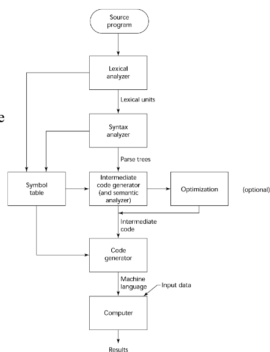
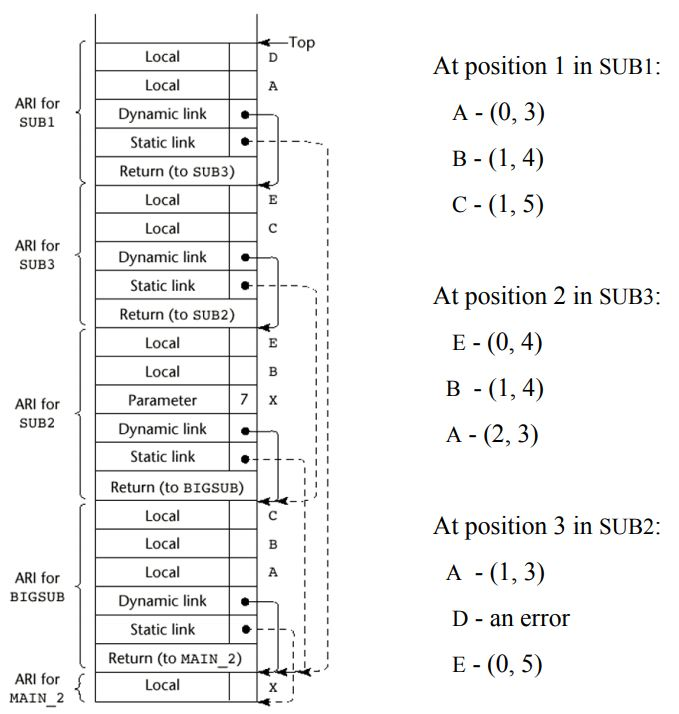
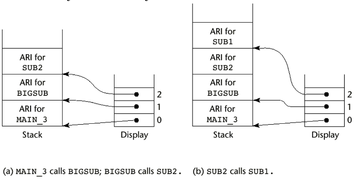
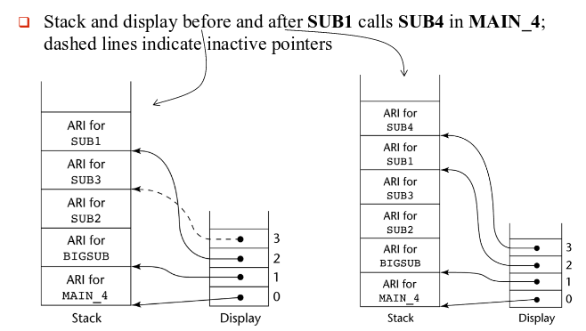
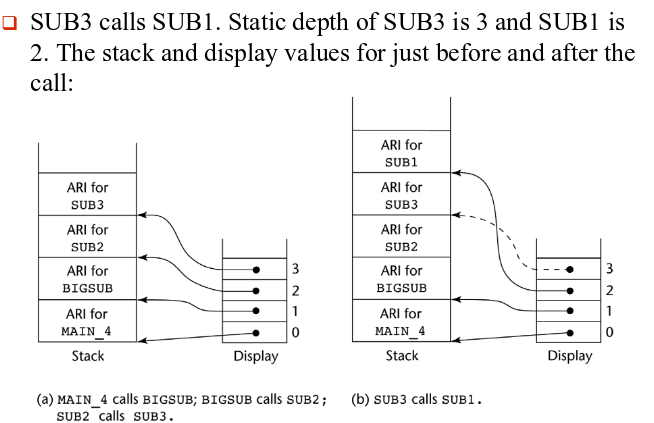
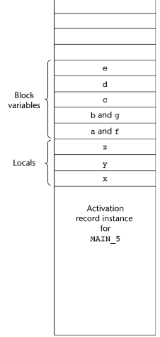
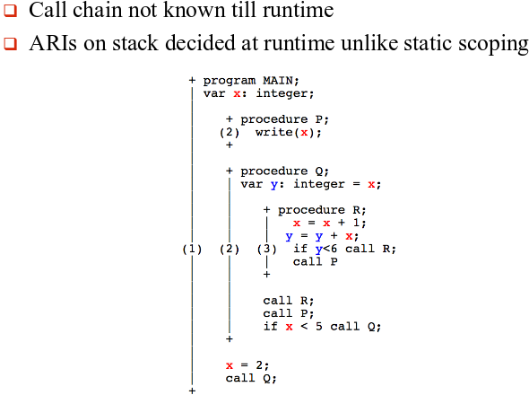

CS408 Notes
==============

## Programming Paradigms
* __Functional Programming__
	+ Applies functions to parameters to accomplish task
	+ Computation is specified by a call to defined functions which are calls to other functions
  - LISP, Scheme, ML
* __Imperative Programming__
	+ commands, action oriented
	+ sharp distinction between action and data
	+ no/limited support for abstraction
  - Fortran, Algol60, Pascal, Ada, C
* __Logic Programming__
	+ Predicate logic calculus
	+ axioms (facts) and rules to deduce new facts
  - prolog, prolog++
* __Object Oriented Programming__
	+ Programming based on the concept of "objects", which may contain data, in the form of fields, often known as attributes; and code, in the form of procedures, often known as methods.
  - java, C++, python, ruby


## Compilation and Interpretation
1. The language is brought down to the level of machine
(__compilation__)
    + Source code -> machine code
    + Target code run at later time (run time)
2. The machine is brought up to the level of the language
(__interpretation__)
    + interpreter takes a program and its input at the same time.
    + It scans the program, implementing operations as it encounters them and doing I/O as needed.

### Compilation



## Language Evaluation Criteria
* Readability
	+ __Orthogonality__
		- Orthogonality in programming languages means that language components are independent of each other and they behave the same way in any circumstance, e.g., types vs functions.
	+ __Non-orthogonality__
	+ __Regularity__
		-	Defined as how well the features of a language are integrated
		-	Greater regularity- implies fewer restrictions on the use of particular constructs, fewer strange interactions between constructs and fewer surprises in general in the way the language behaves
	+ __Generality__
		- Language achieves generality by avoiding special cases in the availability or use of constructs and by combining closely related constructs into a single or more general one
	+ __Uniformity__
		- This principle focuses on the consistency of appearance and behavior of language constructs
	+ __Nonuniformity__
		- Similar things do not look similar or behave similarly
		- Dissimilar things actually look similar or behave similarly when they should not
	+ __Syntax Considerations__
* Writability
	+ __Orthogonality__
	+ __Abstraction__
	+ __Expressivity__
* Reliability
	+ __Type Checking__
	+ __Exception Handling__
	+ __Aliasing__
	+ __Readability and Writability__
* __Portability__
* __Generality__
* __Completeness__

| Characteristic           | Readability | Writablity | Reliability |
|--------------------------|:-----------:|:----------:|:-----------:|
| Simplicity/Orthogonality |      x      |      x     |      x      |
| Control Structures       |      x      |      x     |      x      |
| Data type/Structures     |      x      |      x     |      x      |
| Syntax Design            |      x      |      x     |      x      |
| Support for Abstraction  |             |      x     |      x      |
| Expressivity             |             |      x     |      x      |
| Type Checking            |             |            |      x      |
| Exception Handling       |             |            |      x      |
| Restrictive Aliasing     |             |            |      x      |


## Syntax and CFG
### Syntax
What is the syntax of a language?
* the form or structure of the expressions, statements, and program units

What is the semantics of a language?
* the meaning of the expressions, statements, and program units

What are lexemes?
* Small units (words) of a PL used to build up a statement

What are tokens?
* The category of its lexeme

### CFG: series of grammar rules (called productions) such that
* Left hand side which is a single structure name, followed by the metasymbol ->, followed by a right hand side
* Right hand side can be symbols or other structure names
* Name of structures called nonterminals as they can be broken into further structures
* Words and token symbols are called terminals, as they are never broken
* Grammar rules are called productions
* Symbols used `|` and sometimes parenthesis (`<>` or `()` )
* Derivation: generating language sentences through a series of applications of the rules
* Grammar for Simple Integer Arithmetic Expressions
```CFG
	expr -> expr + expr | expr * expr | (expr) | number
	number -> number digit | digit  (note recursion here)
	digit -> 0 | 1 | 2 | 3 | 4 | 5 | 6 | 7 | 8 | 9
```
* How many terminals, non-terminals and productions in the previous example? 14, 3, 3?

### Parse Trees
### Ambiguous Grammars
### Leftmost Derivation


## Variables
### 6 Attributes
 * Name
 * Type
 * Address
 * Value    
 * Scope        Spatial
 * Lifetime    Temporal     (how long is the variable bound to the same memory location)


### Binding
* __Static__ - bound to memory cells before execution begins and remains bound to the same memory cell throughout execution.
	+ Advantage - history sensitive
	+ Disadvantage - no recursive functions for languages that use only static variable
* __Stack-dynamic__ - Storage bindings are created for variables when their declaration statements are elaborated, which is during run time
	+ Advantage - allows recursion, saves memory/storage
	+ Disadvantage - run-time allocation/deallocation, loss of history sensitivity.
* __Heap-dynamic__ - Allocated and unallocated by explicit directives, specified by the programmer, which take effect during execution
	+ Advantage: flexibility of efficient memory management
	+ Disadvantage: error-prone use of pointers and references
* __Implicit heap-dynamic variables__ - Allocation and deallocation caused by assignment statements
	+ Advantages - help in writing generic code, highly flexible
  - used in purely interpreted languages
	+ Disadvantages - maintaining all dynamic attributes have a high overhead time, loss of error detection.

## Scoping
### Static
```Pascal
procedure big;
	var a, b: integer;
			procedure sub1;
				var x, y: integer ;
				begin {sub1}
					... (1)
				end ;{sub1}
			procedure sub2;
				var x: integer;
					...
				procedure sub3;
					var x: integer;
					begin {sub3}
						... (2)
					end ; {sub3}
				begin {sub2}
					... (3)
				end ; {sub2}
	begin {big}
		... (4)
	end ; {big}

```

Referencing environment at different points in the code

1. `x`, `y` of `sub1` and `a`,`b` of `big`
2. `x` of `sub3` and `a` and `b` of `big`
3. `x` of `sub2` and `a` and `b` of `big`
4. `a` and `b` of `big`

Is scope of `sub1` a static ancestor of `sub3`?


### Dynamic
```C++
void sub1() {
int a,b ;
... (1)
}
void sub2() {
int b, c ;
... (2)
sub1();
}
void main() {
int c, d ;
... (3)
sub2() ;
}
```

Referencing environment at different points in the code

1. `a`, `b` of `sub1`, `c` of `sub2` and `d` of `main`
2. `b` and `c` of `sub2` and `d` of `main`
3. `c` and `d` of `main`


## Data types

### Arrays
#### Row and Column major Addressing
Row major addressing
```Java
Location(a[i][j]) = address(a[1][1]) + (i-1)*n*element_size + (j-1)*element_size;
```
Column major addressing
```Java
Location(a[i][j]) = address(a[1][1]) + (j-1)*m*element_size + (i-1)*element_size;
```
### Pointers and References
A pointer can point to many different objects during its lifetime, a reference can refer to only one object during its lifetime.

Dangling Pointer

```C++
int *x,  *y  ;
x = new int [1] ;
*x = 1 ;
y = x;
delete [] x ;
cout << *y ;
```
#### Pointer Confusion

```C++
int *x, *y, *z, *a, *c, b[3] = {1, -4, 5} ;
a = new int [3] ; //creating an array of 3 elements
x = a ;
a[0] = 0; a[1] = 1; a[2] = 2;
cout << a[0] << "\t"<< a[1] << "\t" << a[2] << endl ; // statement 1
z = &b[1] ;
y = x+2 ;
cout <<*x<< "\t"<< *y << endl ; // statement 2
*x = *x-3 ;
cout << *x << endl ; // statement 3
*(++z) = *(--y) + *x ;
cout << *z << endl ; // statement 4
*y++ = *&b[2]*(* --z);
cout << *y << endl ; // statement 5
c = new int ;
*c = 2 ;
for(int j = 0 ; j< 3 ; j++)
cout << a[j] << "\t" << b[j] << endl ; // statement 6
delete [] a;
cout << *x << endl ; // statement 7
c = NULL ;
```

##### Pointers Well Understood

|   |   |   |            |
|:-:|:-:|:-:|------------|
| 0 | 1 | 2 | statement1 |
| 0 | 2 |   | statement2 |
|-3 |   |   | statement3 |
|-2 |   |   | statement4 |
| 2 |   |   | statement5 |
|-3 | 1 |   | statement6 |
| 8 |-4 |   |            |
| 2 |-2 |   |            |
| junk  |   |   | statement7 |

## Expressions and Assignment Statements
### Functional Side Effect
* When a function changes one of its parameter or a global or nonlocal variable
    + Expression such as `a + fun(a)`  has a side effect if a is changed by the function `fun()`

```C++
int a = 4;

int fun1() {
	a = 17 ;
	return 6;
}

void fun2() {
	a = a + fun1() ;
}

void main() {
	fun2();
}
```

What are the values of `a` in `fun2`
in both the scenarios in C/C++
Java?

`10` and `23`

### Type Conversions
* Forcing a variable of one type to convert to another type
* A _narrowing conversion_ is one that converts an object to a type that cannot include all of the values of the original type. e.g., double to int
* A _widening conversion_ is one in which an object is converted to a type that can include at least approximations to all of the values of the original type. e.g., int to float
* A _mixed-mode_ expression is one that has operands of different types

### Coercion
* Coercion: implicit type conversion
* Is it good or bad feature to have
* They decrease in the type error detection ability of the
compiler
* In most languages, all numeric types are coerced in
expressions, using widening conversions
* In Ada, there are virtually no coercions in expressions
* Java has half of C++'s 32 coercion rules
	+ `byte a, b, c;`
	+ `a = b + c ;` + acts does numeric addition after implicit cast on b and c
* Explicit type conversion: called a cast
	+ In C: `(float)a` will convert a to float type

## Control Structures
### Two Categories
* Iterative (loops)
	+ Pre test
	+ Post test
* Conditional - Relational expressions?
* Benefits - enhances writability of the PL

### switch vs if-else
* Switch only uses an ~~espresso~~ expression.
* apparently no difference between while and do while, except it will run always once at least

## Implementing Subprograms
### Subprograms
#### What are subprograms?
* Definition
    + A description of the actions of the subprogram abstraction
* Subprogram call
    + an explicit request that the subprogram be executed
* Subprogram header
    + The first line of the definition, including the name, the kind of subprogram and the formal parameters.

* Why are parameters called formal parameters?
    + Arguments != parameters
        - Arguments are informal parameters, their values are being sent into the subprogram.
        - parameters are formal parameters, no value (like your egress) Placeholder for you are code.

* The parameter profile of a subprogram is the number, order, and type of its parameters
* the protocol of a subprogram is its parameter profile plus something else RETURN TYPE

#### Parameter Passing
* __Pass by Value__
	* Most common mechanism of parameter passing
	* Default in C++ and Pascal and essentially the only parameter passing mechanism in C and Java.
	* Copy of the actual is passed into function
	* Downside is that it uses more memory
* __Pass by Result__
	* Implementation of out-mode parameters
	* Before the control is handed back to the caller, the formal parameter is passed to the actual parameter.
	* Downside: parameter collision
* __Pass by Value Result__
	* Combines the actions of the IN and OUT parameters
	* Value of actual parameter is used to initialize the corresponding formal parameter
	* Same disadvantages as pass by value and pass by result
	* Pascal VAR parameters
	* Addresses to which to return the values are always calculated on entry of the subprogram
* __Pass by Reference__
	* Second implementation for in out mode
	* Transmits an access path, usually
* __Pass by Name__
	* By textual substitution of formal parameter with the actual parameter in all occurrences in the subprogram.
		+ Idea is that the argument is not evaluated until its actual use.
		* Formals are bound to an access method at the time of the call,  but actual binding to a value or address takes place at the time of a reference or assignment
		* Purpose: flexibility of late binding
		* To solve: rewrite function by replacing the name of the parameter with the argument
	* Example:
```C++
int p(int y);
int j = y
i++;
return (j + y);
```
Converted to:
```C++
int p(int i+j);
int j = i + j;
i++;
return (j + i + j);
```


#### Overloaded Subprograms
* Subprograms with same name and referencing environment but different in number, order, or type of parameters
    + Also called polymorphism (static and dynamic)
        - static - operator overloading. The body must know at compile time. Binding the meaning of the function or operator to the body of statements at compile time
* Mixing call by value and call by reference in the exact same parameter list is also invalid


#### Activation Record
* The only ARI's you see are of active subprograms
    + Active subprograms are ones that have begun execution, but hasn't finished it
    + once finished ARI is removed from the stack
* Drawing Runtime Stack
    + Look at which subprogram you are in, what are the currently active ones, draw stack in order they were called

* Dynamic Link Pointer Use (in statically scoped languages):
    + To tear down the ARI stack on subprogram completion

* A static chain is a chain of static links that connects certain activation record instances.

* Every local variable has a chain offset of 0

* However many static links you follow in the ARI to get to the place where the variable is declared is the offset
    + Local offset - count from bottom of subs ARI to the location below the one with the var in it

##### Example
```Pascal
program MAIN_2;
	var X : integer;
	procedure BIGSUB;
			var A, B, C : integer;
			procedure SUB1;
				var A, D : integer;
				begin { SUB1 }
					A := B + C; //<---------------1
				end; { SUB1 }
			procedure SUB2(X : integer);
			var B, E : integer;
			procedure SUB3;
				var C, E : integer;
				begin { SUB3 }
					SUB1;
					E := B + A; //<---------------2
				end; { SUB3 }
			begin { SUB2 }
				SUB3;
				A := D + E; //<---------------3
			end; { SUB2 }
		begin { BIGSUB }
		SUB2(7);
		end; { BIGSUB }
	begin
	BIGSUB;
end. { MAIN_2 }
```
Call sequence for `MAIN_2`

1. `MAIN_2` calls `BIGSUB`
2. `BIGSUB` calls `SUB2`
3. `SUB2` calls `SUB3`
4. `SUB3` calls `SUB1`

`MAIN_2` > `BIGSUB` > `SUB2` > `SUB3`




### Displays
* Collect all static links into a global array of pointers called display
* When you call a new program, add the pointer to the display array
* Display offset is similar to chain offset, and is used to link to the correct ARI and then a local offset is used to find the location of the variable
* Display offset only depends on the static depth of the procedure in which the nonlocal reference appears
### Display Modification
* Let PSD be the static depth of P, and QSD be the static depth of Q
* Assume Q calls P
* There are three possible cases
    + QSD = PSD Page 25
    + QSD < PSD Page 28
    + QSD > PSD

```Pascal
program MAIN_3;
    procedure BIGSUB;
        procedure SUB1;
        end; { SUB1 }
        procedure SUB2;
            procedure SUB3;
            end; { SUB3 }
        end; { SUB2 }
    end; { BIGSUB }
end. { MAIN_3 }
```

#### Case Qsd=Psd
* `SUB2` calls `SUB1` as they are both at depth 2. Display shown just before and just after the call.


* Display links of `SUB1` and `SUB2` must occupy same position in the display array
* Display link stored in the new activation record, the position 2 in the array points to the ARI of `SUB1`
* When `SUB1` finishes executing, the link is reset to the ARI of `SUB2` at position 2.

#### Case Qsd\<Psd (nontrivial case)

* Consider the following example which has an extra procedure called
`SUB4`

```Pascal
program MAIN_4;
    procedure BIGSUB;
        procedure SUB1;
            procedure SUB4;
            end; { SUB4 }
        end; { SUB1 }
        procedure SUB2;
            procedure SUB3;
            end; { SUB3 }
        end; { SUB2 }
    end; { BIGSUB }
end. { MAIN_4 }
```

Execution has the following sequence of calls
`MAIN_4` calls `BIGSUB`
`BIGSUB` calls `SUB2`
`SUB2` calls `SUB3`
`SUB3` calls `SUB1`



#### Case Qsd\>Psd



### Static Chain vs Display Methods
* The display can be kept in registers, if there are enough--it speeds up access and maintenance
* References to locals
	+ Not much difference
* References to nonlocals
	+ If it is one level away, they are equal
	+ If it is farther away, the display is faster
	+ Display is better for time-critical code, because all nonlocal references cost the same
* Procedure calls
	+ For one or two levels of depth, static chain is faster, else, the display is faster

### Implementing Blocks

* Two Methods:
* Treat blocks as parameterless subprograms
	+ Use activation records for each block
	+ An instance of its activation record is created each time a block is entered
* Blocks can be implemented in another simpler way:
* Max storage can be determined statically
	+ Blocks are entered and exited in a strictly textual order
	+ This amount of space can be allocated after the local variables in the ARI
	+ Offsets for all block variables can be statically computed and hence can be addressed as if they were local variables

Implementing Blocks
* Note f and g occupy the same memory locations as a
and b. Why?
* Because a and b are popped of the stack when their
block is exited (i.e. before f and g are allocated)

```C++
void main(){
    int x,y,z;
    while(..){
        int a,b,c;
        ..
        while(..){
            int d, e;
            ..
        }
    }
    while(..){
        int f,g;
        ..
    }
    ...
}
```



### Dynamic Scoping


```C++
void C() {
int x, z ;
x = u+v ;
…
}
void B() {
int w, x ;
…
}
void A() {
int v, w ;
…
}
void main() {
int v, u ;
…
}
```

* Deep Access - nonlocal references are found by searching the activation record instances on  the dynamic chain

* Shallow Access - variables declared in subprograms are not stored in the ARIs of those subprograms
	+ Since only one visible version of the variable is present at any given time because of dynamic scoping
* Use of one stack for each variable name
* Push the most recent subprogram name for each variable into the stack and pop it after the subprogram is terminated


* Another method for shallow access is the use of a central table
	+ Place all local variables for a subprogram in central table and mark it as active (using a mark bit with each variable)
	+ When a new variable comes in with same name, store the previously active variable somewhere else during the lifetime of the current variable
	+ Different languages used different implementations of shallow-access
* Choice between shallow and deep access depends on the relative frequencies of access to nonlocal variables and subprogram calls.
	+ Deep access provides fast subprogram linkage but slower nonlocal access while shallow access is the reverse, as it provides fast access to distant nonlocals

#### Dynamic vs. Static Scoping
* Two reasons for dynamically scoped languages are slower than statically(lexically) scoped languages
* Firstly, Dynamically scoped languages are slower than statically scoped languages since the dynamic chain has to be searched for the first instance of the variable
* Secondly, activation records must store variable names as well unlike in statically scoped languages where only the values are required
* the (chain\_offset, local\_offset) is used to represent each variable, and not the nam
