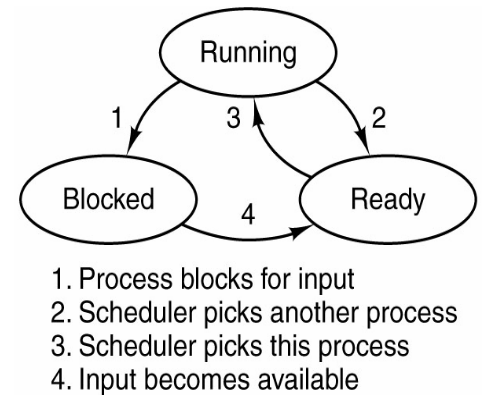

# CS431 Notes

Processing and Threads
----------------------

### The Processes
* Multiprogramming
    + Several jobs are loaded in memory
    + illusion of parallelism - *Pseudo parallelism*
* CPU switches from one process to another based on chosen scheduling algorithm and process state

### The Process Model
#### Two different points of view. 
* Real Model - multiprogramming (rapidly switching back and forth) 
* Conceptual Model - each process has its own virtual CPU, PC, registers, stack pointer

* With the CPU switching back and forth among the processes, its computation time will not be uniform. 
* The computation time is also based on the process type - I/O bounded, CPU bounded.

### Process Creation
* __System initialization__- when an OS is booted, typically <u>several processes</u> are created.
    + Foreground processes
    + Background processes (daemons)
* __Execution of a process creation system call by a running process__- a running process issues system calls to create one or more new processes.
* __A user creates a new process__- in interactive systems, users can start a program by typing a command or (double) clicking an icon.
* __Initiation of a batch job__- mainframe computer

### Process Termination
#### A process terminate due to one of the following condition
* __Normal exit__- done with their work (__voluntary__).
* __Error exit__- the process discovers a fatal error - compiler tries to compile a program, there is no such a file (__voluntary__).
* __Fatal error__- error caused by the processor - a process tries to modify the memory location where other process is located (__involuntary__).
* __Killed by another process__- a deadlock has occurred. Kill the process call, resolve the deadlock (__involuntary__).

### Process State

### Process Implementation
* To implement the process, operating system maintain each process's information in its <u>process table</u>(or <u>process control block</u> __PCB__)
* When a running process's state changes to __block__ state or __ready__ state, OS needs to save information for the process.
* When a process state changes to __running__ state, OS needs to restore information for the process (from its process table) into CPU

#### Contents of a Process Table (or PCB)
* Process status- ready, running, blocked
* Program counter-  address of next instructions for the process
* CPU registers- registers vary in number and type, depending on the computer architecture. 
* CPU scheduling information- a process priority, pointers to the scheduling queues.
* Memory management information- the base and limit registers, the page tables, the segmentation tables.
* Accounting information- the amount of CPU and real time used, time limits, account numbers, process numbers,...
* I/O status information- list of I/O devices allocated to the process, list of open files, and so on ...

Threads
-------
* Threads are processes in a process!!! -multiple executions in the same process environment.
* Each thread has its own: thread ID, program counter, register set, and stack.
* Different threads are not quite as independent as different processes since they share same address space.
* It shares with other threads belonging to the same process its code section, data sectionand other operating system resources such as filesand child processes.
* Multiple processes running on a computer-Processes share physical memory, disks, printers and other resources.
* Multiple threads running on a process- the threads share an address space, open files, and other resources.
* Multiple threads working together -By sharing a set of resources, threads can work together closely to perform some task.
